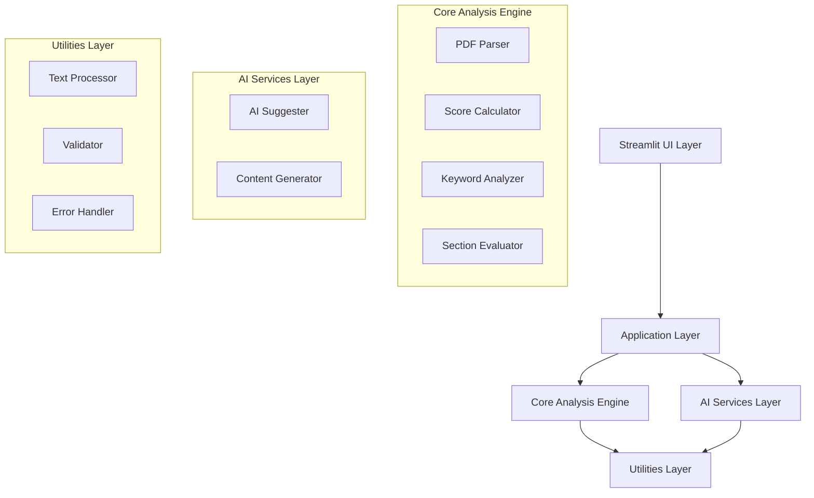

# Design Document: AI-Powered ATS Resume Analyzer

## Overview

The AI-Powered ATS Resume Analyzer is a Python-based system that helps students optimize their resumes for Applicant Tracking Systems. The system follows a modular architecture with distinct components for PDF processing, text analysis, scoring, and AI-powered suggestions. The design emphasizes reliability, performance, and extensibility while providing a user-friendly Streamlit interface.

The core workflow involves: PDF text extraction → job description processing → TF-IDF similarity calculation → keyword gap analysis → section evaluation → AI-powered suggestions → content generation. Each component is designed to be testable, maintainable, and capable of handling edge cases gracefully.

## Architecture

The system follows a layered architecture with clear separation of concerns:



**Layer Responsibilities:**
- **UI Layer**: Streamlit interface for user interactions
- **Application Layer**: Orchestrates analysis workflow and manages state
- **Core Analysis Engine**: Implements core resume analysis algorithms
- **AI Services Layer**: Handles external AI API interactions
- **Utilities Layer**: Provides shared functionality for text processing and validation

## Components and Interfaces

### PDF Parser Component

**Purpose**: Extract and preprocess text content from PDF files

**Interface**:
```python
class PDFParser:
    def extract_text(self, pdf_file: BinaryIO) -> TextExtractionResult
    def validate_pdf(self, pdf_file: BinaryIO) -> ValidationResult
    def preprocess_text(self, raw_text: str) -> str
```

**Key Responsibilities**:
- Handle multiple PDF libraries (pdfplumber primary, PyPDF2 fallback)
- Preserve text structure while removing formatting artifacts
- Validate PDF integrity and readability
- Handle multi-page documents and various PDF formats

### Score Calculator Component

**Purpose**: Compute ATS compatibility scores using TF-IDF similarity

**Interface**:
```python
class ScoreCalculator:
    def calculate_similarity(self, resume_text: str, job_desc: str) -> float
    def normalize_score(self, similarity: float) -> int
    def get_detailed_metrics(self, resume_text: str, job_desc: str) -> ScoreMetrics
```

**Algorithm Details**:
- Uses scikit-learn TfidfVectorizer with custom preprocessing
- Applies cosine similarity between resume and job description vectors
- Normalizes to 0-100 scale using empirically determined thresholds
- Weights technical terms and skills higher than common words

### Keyword Analyzer Component

**Purpose**: Identify missing keywords and rank them by importance

**Interface**:
```python
class KeywordAnalyzer:
    def extract_keywords(self, job_desc: str) -> List[Keyword]
    def find_missing_keywords(self, resume_text: str, job_keywords: List[Keyword]) -> List[MissingKeyword]
    def rank_by_importance(self, keywords: List[MissingKeyword]) -> List[RankedKeyword]
```

**Analysis Strategy**:
- Extract n-grams (1-3 words) from job descriptions
- Filter using custom stop words and professional term dictionaries
- Rank by TF-IDF scores and contextual importance
- Group related terms and synonyms

### Section Evaluator Component

**Purpose**: Analyze and score individual resume sections

**Interface**:
```python
class SectionEvaluator:
    def identify_sections(self, resume_text: str) -> Dict[str, Section]
    def score_section(self, section: Section, job_desc: str) -> SectionScore
    def evaluate_completeness(self, sections: Dict[str, Section]) -> CompletenessReport
```

**Section Types**:
- Contact Information: Validates presence of email, phone, location
- Skills: Matches technical and soft skills against job requirements
- Experience: Evaluates relevance, quantification, and impact statements
- Education: Checks degree relevance and academic achievements

### AI Suggester Component

**Purpose**: Generate improvement recommendations using generative AI

**Interface**:
```python
class AISuggester:
    def generate_suggestions(self, analysis_result: AnalysisResult) -> List[Suggestion]
    def prioritize_suggestions(self, suggestions: List[Suggestion]) -> List[PrioritizedSuggestion]
    def format_suggestions(self, suggestions: List[Suggestion]) -> str
```

**AI Integration**:
- Supports multiple AI providers (OpenAI GPT, Anthropic Claude)
- Uses structured prompts with analysis context
- Implements retry logic and fallback mechanisms
- Validates AI responses for relevance and appropriateness

### Content Generator Component

**Purpose**: Create missing resume sections using AI

**Interface**:
```python
class ContentGenerator:
    def generate_section(self, section_type: str, context: GenerationContext) -> GeneratedContent
    def create_multiple_options(self, section_type: str, context: GenerationContext) -> List[GeneratedContent]
    def validate_generated_content(self, content: GeneratedContent) -> ValidationResult
```

**Generation Strategy**:
- Uses job description and existing resume content as context
- Generates multiple options for user selection
- Validates output for professional tone and relevance
- Provides templates as fallback when AI generation fails

## Data Models

### Core Data Structures

```python
@dataclass
class TextExtractionResult:
    text: str
    page_count: int
    extraction_method: str
    confidence: float
    errors: List[str]

@dataclass
class AnalysisResult:
    compatibility_score: int
    missing_keywords: List[RankedKeyword]
    section_scores: Dict[str, SectionScore]
    suggestions: List[PrioritizedSuggestion]
    processing_time: float

@dataclass
class RankedKeyword:
    term: str
    importance_score: float
    category: str  # technical, soft_skill, industry_specific
    context: str
    suggestions: List[str]

@dataclass
class SectionScore:
    section_name: str
    score: int  # 0-100
    present: bool
    completeness: float
    relevance: float
    feedback: str
    improvement_areas: List[str]

@dataclass
class PrioritizedSuggestion:
    suggestion: str
    priority: int  # 1-5, 1 being highest
    category: str
    impact_estimate: str
    implementation_difficulty: str
```

### Configuration Models

```python
@dataclass
class AIConfig:
    provider: str  # "openai" or "anthropic"
    model: str
    api_key: str
    max_tokens: int
    temperature: float
    timeout: int

@dataclass
class AnalysisConfig:
    min_keyword_length: int
    max_keywords: int
    tfidf_max_features: int
    similarity_threshold: float
    section_weights: Dict[str, float]
```

## Correctness Properties

*A property is a characteristic or behavior that should hold true across all valid executions of a system—essentially, a formal statement about what the system should do. Properties serve as the bridge between human-readable specifications and machine-verifiable correctness guarantees.*

Before writing the correctness properties, I need to analyze the acceptance criteria to determine which ones are testable as properties.

### Property 1: PDF Text Extraction Consistency
*For any* valid PDF file with known text content, extracting text should return the expected content while ignoring non-text elements and preserving structure where possible
**Validates: Requirements 1.1, 1.2, 1.4, 1.5**

### Property 2: Input Validation Completeness
*For any* input to the system, validation should accept valid inputs of reasonable size and reject empty, whitespace-only, or invalid inputs while maintaining system state
**Validates: Requirements 2.1, 2.2, 2.3, 8.1**

### Property 3: Text Preprocessing Consistency
*For any* text input, preprocessing should be applied consistently across all components, removing formatting artifacts and producing identical results for identical inputs
**Validates: Requirements 2.4, 8.2**

### Property 4: Score Calculation Determinism
*For any* pair of resume and job description texts, the TF-IDF similarity calculation should produce consistent scores in the 0-100 range with appropriate weighting and precision
**Validates: Requirements 3.1, 3.2, 3.3, 3.4, 3.5**

### Property 5: Keyword Analysis Completeness
*For any* job description and resume pair, keyword analysis should identify important terms, determine missing keywords, rank them by importance, and exclude stop words consistently
**Validates: Requirements 4.1, 4.2, 4.3, 4.4, 4.5**

### Property 6: Section Evaluation Thoroughness
*For any* resume text, section evaluation should identify standard sections, score them appropriately, flag missing sections, and provide feedback for all evaluated sections
**Validates: Requirements 5.1, 5.2, 5.3, 5.4, 5.5**

### Property 7: AI Suggestion Generation
*For any* analysis result, AI suggestion generation should produce relevant, actionable, professionally-toned recommendations prioritized by impact on ATS compatibility
**Validates: Requirements 6.1, 6.2, 6.3, 6.4**

### Property 8: Content Generation Appropriateness
*For any* missing section and context information, content generation should produce contextually appropriate, professional content with multiple options when possible
**Validates: Requirements 7.1, 7.2, 7.3, 7.4**

### Property 9: Error Handling Robustness
*For any* error condition (corrupted PDFs, AI service failures, generation failures), the system should return descriptive error messages, provide fallbacks, and maintain stability
**Validates: Requirements 1.3, 6.5, 7.5, 8.3**

### Property 10: Result Completeness and Data Handling
*For any* successful analysis, results should include all component outputs, support export functionality, handle large files gracefully, and maintain data privacy by not persisting user content
**Validates: Requirements 2.5, 8.5, 9.4, 10.3, 10.5**

## Error Handling

The system implements comprehensive error handling across all components:

**PDF Processing Errors**:
- Corrupted or unreadable PDFs: Return descriptive error with suggested solutions
- Unsupported formats: Attempt multiple parsing libraries before failing gracefully
- Large file handling: Implement streaming and memory management to prevent crashes

**AI Service Errors**:
- API failures: Implement exponential backoff retry logic
- Rate limiting: Queue requests and provide user feedback
- Service unavailability: Provide template-based fallback suggestions
- Invalid responses: Validate AI output and request regeneration if needed

**Analysis Errors**:
- Empty or invalid inputs: Validate before processing and provide clear feedback
- Processing timeouts: Implement configurable timeouts with progress indicators
- Memory constraints: Use streaming processing for large documents

**System Errors**:
- Configuration errors: Validate configuration on startup
- Dependency failures: Graceful degradation when optional services unavailable
- Unexpected exceptions: Comprehensive logging and user-friendly error messages

## Testing Strategy

The testing approach combines unit testing for specific scenarios with property-based testing for comprehensive coverage:

**Unit Testing Focus**:
- Specific examples of PDF parsing with known documents
- Edge cases for text preprocessing and validation
- Integration points between components
- Error conditions and fallback mechanisms
- AI service mocking and response validation

**Property-Based Testing Focus**:
- PDF text extraction across various document types and formats
- Score calculation consistency across diverse text combinations
- Keyword analysis behavior with different job description styles
- Section evaluation across various resume formats
- Input validation with generated valid and invalid inputs

**Testing Configuration**:
- Property tests run minimum 100 iterations per test
- Each property test references its design document property
- Tag format: **Feature: ats-resume-analyzer, Property {number}: {property_text}**
- Mock external AI services for consistent testing
- Use hypothesis library for Python property-based testing

**Test Data Strategy**:
- Generate synthetic PDFs with known content for parsing tests
- Create diverse job descriptions and resumes for analysis testing
- Use real-world examples (anonymized) for integration testing
- Generate edge cases (empty files, corrupted data, extreme sizes)

The dual testing approach ensures both concrete correctness (unit tests) and general robustness (property tests), providing comprehensive validation of the system's behavior across all possible inputs and scenarios.